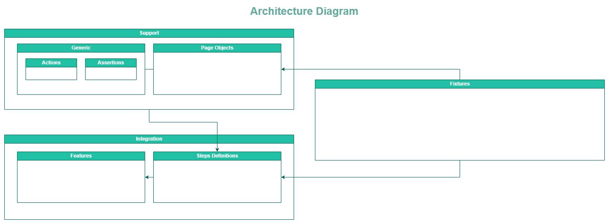

# cypress-final-exercise

### Table of contents
1. [Description](https://github.com/mariecp27/cypress-final-exercise/edit/dev/README.md#description)
2. [Prerequisites](https://github.com/mariecp27/cypress-final-exercise/edit/dev/README.md#prerequisites)
3. [Setup](https://github.com/mariecp27/cypress-final-exercise/edit/dev/README.md#setup)
4. [Developer Notes](https://github.com/mariecp27/cypress-final-exercise/edit/dev/README.md#developer-notes)
5. [Resources](https://github.com/mariecp27/cypress-final-exercise/edit/dev/README.md#resources)

<p align="center"><p/>

---
## Description
Create a framework for scratch using cypress (any version), cucumber, and allure reporter, to test the web page: https://www.demoblaze.com/. The framework should include test cases for the following functionalities:
1. Test the featured items Carousel. It should be in a feature including at least 3 scenarios.
2. Test Navigation to all header links. It should be in a feature including at least 3 scenarios.
3. Test the categories Selection, product Selection, Adding product to cart, Buying cart, Removing element from cart. All of the defined scenarios for these functionalities should be on a feature.

### Rules
- The exercise must be delivered using a new, personal github repository, Good git practices should be used.
- The framework should be organized using best practices, and following what suits best to the software under test. All architectural decisions should be correctly fundamented. An architecture diagram of the framework must be included on the repo.
- All defined scenarios must be tagged in any way you decide, including at least tags for organization, and for different suites (regression, smoke, sanity). Tags for using hooks are optional.
- The framework must include at least the use of: cy.request, cy.intercept, POM, fixtures.
- Test cases to implement should be designed following best practices and correct organization.

## Prerequisites
[Node.js](https://nodejs.org/en/) is needed for running the current project. Version ```18.12.1``` was used.

## Setup
1. Download/clone current project.
2. Run command ```npm install```.
3. ```package.json``` file has already some preloaded scripts for running the project:
    1. ```npm run open```: Run the project by using [Cypress](https://www.cypress.io/) interface.
    2. ```npm run headless```: Run the project in a headless mode (no browser will be opened).
    3. ```npm run allure```: Run the project in a headless mode by using [Allure Framework](https://docs.qameta.io/allure/) as the reporter.
    4. ```npm run allure:results```: Open Allure reports that were previously generated.
    5. ```npm run tag```: Run the project in a headless mode. **The tag must be modified to the desired one.**
 
## Developer Notes
- Cypress version ```9.7.0``` is being used, thus, the tests are located inside the folder ```cypress/integration```.
- Since [Cucumber](https://cucumber.io/) was used for writing the tests, they are structured with Features and Steps Definitions.
- ```cypress/fixtures``` can be used for storing test data. It is recommended to use ```.json``` format.
- ```cypress/plugins/index.js``` contains current Cucumber and Allure configuration.
- ```cypress/support``` has the reusable code:
    1. Generic custom functions.
    2. Generic custom assertions for the tests.
    3. It is important to point out that **Page Object Model** is being used, then, the page objects are also located in ```cypress/support```.
    
## Resources
- [Node.js](https://nodejs.org/en/)
- [Cypress Documentation](https://docs.cypress.io/guides/overview/why-cypress)
- [Allure Framework Documentation](https://docs.qameta.io/allure/)
- [Cucumber Documentation](https://cucumber.io/)
